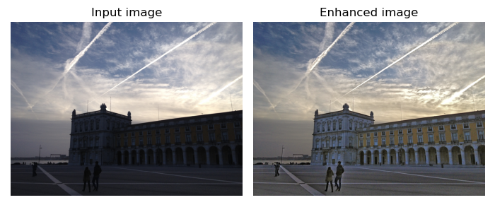
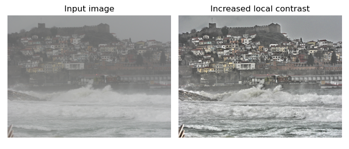
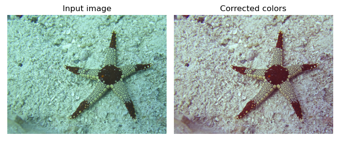

# image_enhancement
Library of NumPy-based Image Processing functions for various types of Image Enhancement, including:
- Spatial Tone Mapping
- Local Contrast Enhencement
- Color Correction (White Balance)
- Color Saturation Adjustment

# Examples:







# Functions:
  contains:
- **get_photometric_mask()**: Estimates local brightness distribution (edge-aware blurring).
- **apply_local_contrast_enhancement()**: Adjusts strength of local details.
- **apply_spatial_tonemapping()**: Adjusts brightness levels in dark and bright regions. 
- **transfer_graytone_to_color()**: Transfers tones from a tone-mapped grayscale image to a color image. 
- **change_color_saturation()**: Adjusts the color vibrance of an image. 
- **correct_colors()**: Removes color casts from images.
- **srgb_to_linear()**: Transforms image to the linear color space. 
- **linear_to_srgb()**: Transforms image to the gamma-corrected color space. 
- **enhance_image()**: Applies multiple stages of enhancement to an image. 

# Contents:
```tree
├── src                                        [Directory: Source code]
│   ├── image_enhancement.py                   [Main script with all the functions] 
│   ├── example_color_correction.py            [Example of applying color correction]
│   ├── example_enhance_image.py               [Example of combined image enhancement]
│   ├── example_local_contrast_enhancement.py  [Example of applying increasing local details]
│   └── example_medical_image.py               [Example of processing medical images]
└── images                                     [Directory: Sample test images]
```

# Dependences
- numpy
- imageio
- skimage (can be easily bypassed if needed)

# Dataset
If you want to try this code in real-life challenging travel photos, please try the following dataset:

[TM-DIED: The Most Difficult Image Enhancement Dataset](https://sites.google.com/site/vonikakis/datasets/tm-died)

# Citations
If you use this code in your research please cite the following papers:   
1. [Vonikakis, V., Andreadis, I., & Gasteratos, A. (2008). Fast centre-surround contrast modification. IET Image processing 2(1), 19-34.](https://www.researchgate.net/publication/3481092_Fast_centre-surround_contrast_modification)
2. [Vonikakis, V., Winkler, S. (2016). A center-surround framework for spatial image processing. Proc. IS&T Human Vision & Electronic Imaging, (Retinex020), San Francisco, CA, Feb. 14-18.](http://vintage.winklerbros.net/Publications/ei2016hvei.pdf)
3. [Vonikakis, V., Arapakis, I. & Andreadis, I. (2011).Combining Gray-World assumption, White-Point correction and power transformation for automatic white balance. International Workshop on Advanced Image Technology (IWAIT), 1569353295.](https://www.researchgate.net/publication/235350557_Combining_Gray-World_assumption_White-Point_correction_and_power_transformation_for_automatic_white_balance)
4. [Vonikakis, V., & Andreadis, I. (2008). Multi-Scale Image Contrast Enhancement. ICARCV 2008. (pp. 385-391).](https://www.researchgate.net/publication/221145067_Multi-Scale_Image_Contrast_Enhancement)
